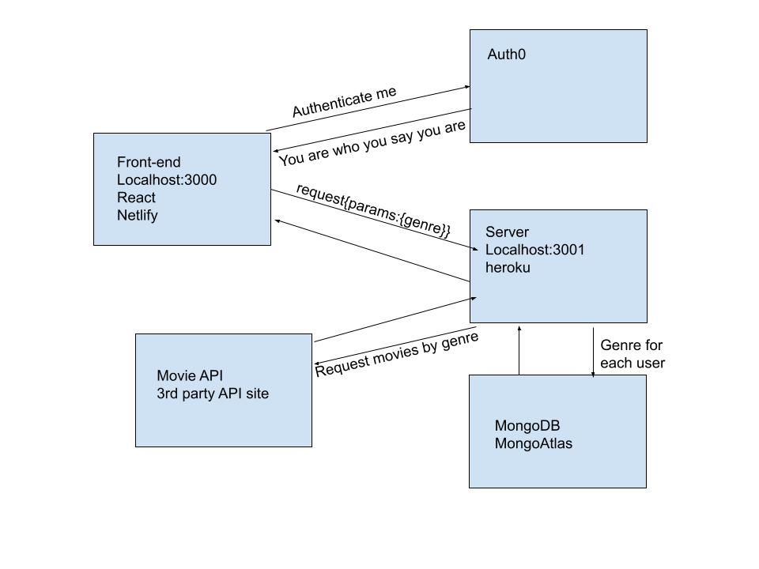
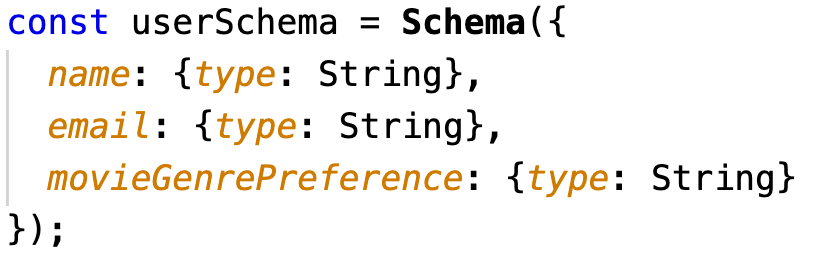
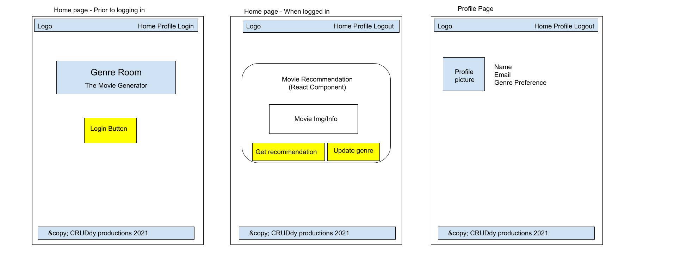

# genre-room-front-end
Front End Repo

**Team Members:**
Chris Gantt
Jakob Lumpkin
Jessi Velazquez
Simone Odegard

**Descritpion of Project**

This is an entertainment recommendation site. The user will create an account in which they can add, update, and delete preferences for types of entertainment and the API/s will send back recommendations. We will start by including a movie recommender. Stretch goals are to include recommendations for music and books. On the user profile, under each type of entertainment is where the preferences will live on the front end.

**User stories**
[Link to Trello](https://docs.google.com/document/d/1CdsHYnbm2qrBjmilGVpoNDrKQsEQk8bcfJV45zILvbU/edit#)

**Software Requirements**
[Link to requirements](./requirements.md)

**Domain Modeling**

**Entity Relationship**

**Wire Frames**

